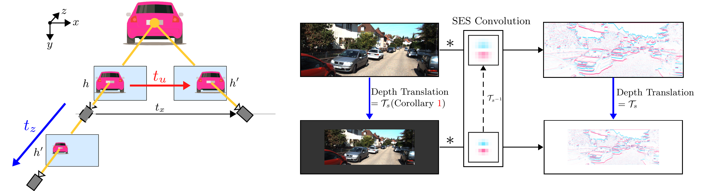

# [DEVIANT: Depth EquiVarIAnt NeTwork for Monocular 3D Object Detection](https://arxiv.org/pdf/2207.10758.pdf)

### [KITTI Demo](https://www.youtube.com/watch?v=2D73ZBrU-PA) | [KITTI Eqv Error Demo](https://www.youtube.com/watch?v=70DIjQkuZvw) | [Waymo Demo](https://www.youtube.com/watch?v=46S_OGxYFOM) | [Project](http://cvlab.cse.msu.edu/project-deviant.html) | [Slides]()

[Abhinav Kumar](https://sites.google.com/view/abhinavkumar/)<sup>1</sup>, 
[Garrick Brazil](https://garrickbrazil.com/)<sup>2</sup>, 
[Enrique Corona](https://www.linkedin.com/in/enrique-corona-0752b84)<sup>3</sup>, 
[Armin Parchami](https://www.linkedin.com/in/parchami/)<sup>3</sup>, 
[Xiaoming Liu](http://www.cse.msu.edu/~liuxm/index2.html)<sup>1</sup> <br>
<sup>1</sup>Michigan State University, <sup>2</sup>Meta AI, <sup>3</sup>Ford Motor Company

in [ECCV 2022](https://eccv2022.ecva.net/)




> Modern neural networks use building blocks such as convolutions that are equivariant to arbitrary 2D translations $(t_u, t_v)$. However, these vanilla blocks are not equivariant to arbitrary 3D translations $(t_x, t_y, t_z)$ in the projective manifold. Even then, all monocular 3D detectors use vanilla blocks to obtain the 3D coordinates, a task for which the vanilla blocks are not designed for. This paper takes the first step towards convolutions equivariant to arbitrary 3D translations in the projective manifold. Since the depth is the hardest to estimate for monocular detection, this paper proposes Depth EquiVarIAnt NeTwork (DEVIANT) built with existing scale equivariant steerable blocks. As a result, DEVIANT is equivariant to the depth translations $(t_z)$ in the projective manifold whereas vanilla networks are not. The additional depth equivariance forces the DEVIANT to learn consistent depth estimates, and therefore, DEVIANT achieves state-of-the-art monocular 3D detection results on KITTI and Waymo datasets in the image-only category and performs competitively to methods using extra information. Moreover, DEVIANT works better than vanilla networks in cross-dataset evaluation.


Much of the codebase is based on [GUP Net](https://github.com/SuperMHP/GUPNet). Some implementations are from [GrooMeD-NMS](https://github.com/abhi1kumar/groomed_nms) and [PCT](https://github.com/amazon-research/progressive-coordinate-transforms). Scale Equivariant Steerable (SES) implementations are from [SiamSE](https://github.com/ISosnovik/SiamSE).

[](https://arxiv.org/abs/2207.10758)
[](https://opensource.org/licenses/MIT)

## Citation

If you find our work useful in your research, please consider starring the repo and citing:

```Bibtex
@inproceedings{kumar2022deviant,
   title={{DEVIANT: Depth EquiVarIAnt NeTwork for Monocular $3$D Object Detection}},
   author={Kumar, Abhinav and Brazil, Garrick and Corona, Enrique and Parchami, Armin and Liu, Xiaoming},
   booktitle={ECCV},
   year={2022}
}
```

## Setup

- **Requirements**

    1. Python 3.7
    2. [PyTorch](http://pytorch.org) 1.10
    3. Torchvision 0.11
    4. Cuda 11.3
    5. Ubuntu 18.04/Debian 8.9

This is tested with NVIDIA A100 GPU. Other platforms have not been tested. Clone the repo first. Unless otherwise stated, the below scripts and instructions assume the working directory is the directory `code`:

```bash
git clone https://github.com/abhi1kumar/DEVIANT.git
cd DEVIANT/code
```

- **Cuda & Python**

Build the DEVIANT environment by installing the requirements:

```bash
conda create --name DEVIANT --file conda_GUP_environment_a100.txt
conda activate DEVIANT
pip install opencv-python pandas
```

- **KITTI, nuScenes and Waymo Data**

Follow instructions of [data_setup_README.md](code/data/data_setup_README.md) to setup KITTI, nuScenes and Waymo as follows:

```bash
./code
├── data
│      ├── KITTI
│      │      ├── ImageSets
│      │      ├── kitti_split1
│      │      ├── training
│      │      │     ├── calib
│      │      │     ├── image_2
│      │      │     └── label_2
│      │      │
│      │      └── testing
│      │            ├── calib
│      │            └── image_2
│      │
│      ├── nusc_kitti
│      │      ├── ImageSets
│      │      ├── training
│      │      │     ├── calib
│      │      │     ├── image
│      │      │     └── label
│      │      │
│      │      └── validation
│      │            ├── calib
│      │            ├── image
│      │            └── label
│      │
│      └── waymo
│             ├── ImageSets
│             ├── training
│             │     ├── calib
│             │     ├── image
│             │     └── label
│             │
│             └── validation
│                   ├── calib
│                   ├── image
│                   └── label
│
├── experiments
├── images
├── lib
├── nuscenes-devkit        
│ ...
```


- **AP Evaluation**

Run the following to generate the KITTI binaries corresponding to `R40`:

```bash
sudo apt-get install libopenblas-dev libboost-dev libboost-all-dev
sudo apt install gfortran
sh data/KITTI/kitti_split1/devkit/cpp/build.sh
```

We finally setup the Waymo evaluation. The Waymo evaluation is setup in a different environment `py36_waymo_tf` to avoid package conflicts with our DEVIANT environment:

```bash
# Set up environment
conda create -n py36_waymo_tf python=3.7
conda activate py36_waymo_tf
conda install cudatoolkit=11.3 -c pytorch

# Newer versions of tf are not in conda. tf>=2.4.0 is compatible with conda.
pip install tensorflow-gpu==2.4
conda install pandas
pip3 install waymo-open-dataset-tf-2-4-0 --user
```

To verify that your Waymo evaluation is working correctly, pass the ground truth labels as predictions for a sanity check. Type the following:

```bash
/mnt/home/kumarab6/anaconda3/envs/py36_waymo_tf/bin/python -u data/waymo/waymo_eval.py --sanity
```

You should see AP numbers as 100 in every entry after running this sanity check.


## Training

Train the model:

```bash
chmod +x scripts_training.sh
./scripts_training.sh
```

The current Waymo config files use the full val set in training. For Waymo models, we had subsampled Waymo validation set by a factor of 10 (4k images) to save training time as in [DD3D](https://github.com/TRI-ML/dd3d#models). Change `val_split_name` from `'val'` to `'val_small'` in waymo configs to use subsampled Waymo val set.

## Testing Pre-trained Models

### Model Zoo

We provide logs/models/predictions for the main experiments on KITTI Val /KITTI Test/Waymo Val data splits available to download here.

| Data Split | Method  | Run Name/Config Yaml                                                       | Weights  |
|------------|---------|----------------------------------------------------------------------------|----------|
| KITTI Val  | GUP Net | [config_run_201_a100_v0_1](code/experiments/config_run_201_a100_v0_1.yaml) | [gdrive](https://drive.google.com/file/d/17qezmIjckRSAva1fNnYBmgR9LaY-dPnp/view?usp=sharing)   |     
| KITTI Val  | DEVIANT | [run_221](code/experiments/run_221.yaml)                                   | [gdrive](https://drive.google.com/file/d/1CBJf8keOutXVSAiu9Fj7XQPQftNYC1qv/view?usp=sharing)   |
| KITTI Test | DEVIANT | [run_250](code/experiments/run_250.yaml)                                   | [gdrive](https://drive.google.com/file/d/1_79GfHcpAQR3wdvhj9GDHc7_c_ndf1Al/view?usp=sharing)   |
| Waymo Val  | GUP Net | [run_1050](code/experiments/run_1050.yaml)                                 | [gdrive](https://drive.google.com/file/d/1wuTTuZrFVsEv4ttQ0r3X_s8D3OjYE84E/view?usp=sharing)   |
| Waymo Val  | DEVIANT | [run_1051](code/experiments/run_1051.yaml)                                 | [gdrive](https://drive.google.com/file/d/1ixCVS85yVU9k6kuHrcYw_qJoy9Z4d0FD/view?usp=sharing)   |

### Testing

Make `output` folder in the `code` directory:

```bash
mkdir output
```
Place models in the `output` folder as follows:

```bash
./code
├── output
│      ├── config_run_201_a100_v0_1
│      ├── run_221
│      ├── run_250
│      ├── run_1050
│      └── run_1051
│
│ ...
```

Then, to test, run the file as:

```bash
chmod +x scripts_inference.sh
./scripts_inference.sh
```

### Cross-Dataset Evaluation of KITTI on nuScenes Frontal Val

See [scripts_inference.sh](code/scripts_inference.sh)

### Qualitative Plots

To get qualitative plots, type the following:

```bash
python plot/plot_qualitative_output.py --dataset waymo --folder output/run_1051/results_test/data
```

Type the following to reproduce our other plots:

```bash
python plot/plot_sesn_basis.py
python plot/visualize_output_of_cnn_and_sesn.py
```

## FAQ

- **Inference on older cuda version** For inference on older cuda version, type the following before running inference:

```bash
source cuda_9.0_env
```

- **Correct Waymo version** You should see a 16th column in each ground truth file inside `data/waymo/validation/label/`. This corresponds to the `num_lidar_points_per_box`. If you do not see this column, run:

```bash
cd data/waymo
python waymo_check.py 
```

to see if `num_lidar_points_per_box` is printed. If nothing is printed, you are using the wrong Waymo dataset version and you should download the correct dataset version.

- **Cannot convert a symbolic Tensor (strided_slice:0) to a numpy array**  This error indicates that you're trying to pass a Tensor to a NumPy call". This means you have a wrong numpy version. Install the correct numpy as:

```bash
pip install numpy==1.19.5
```

## Acknowledgements
We thank the authors of [GUP Net](https://github.com/SuperMHP/GUPNet), [GrooMeD-NMS](https://github.com/abhi1kumar/groomed_nms), [SiamSE](https://github.com/ISosnovik/SiamSE), [PCT](https://github.com/amazon-research/progressive-coordinate-transforms) and [patched nuscenes-devkit](https://github.com/abhi1kumar/nuscenes-devkit) for their awesome codebases. Please also consider citing them.

## Contact
For questions, feel free to post here or drop an email to this address- ```abhinav3663@gmail.com```
